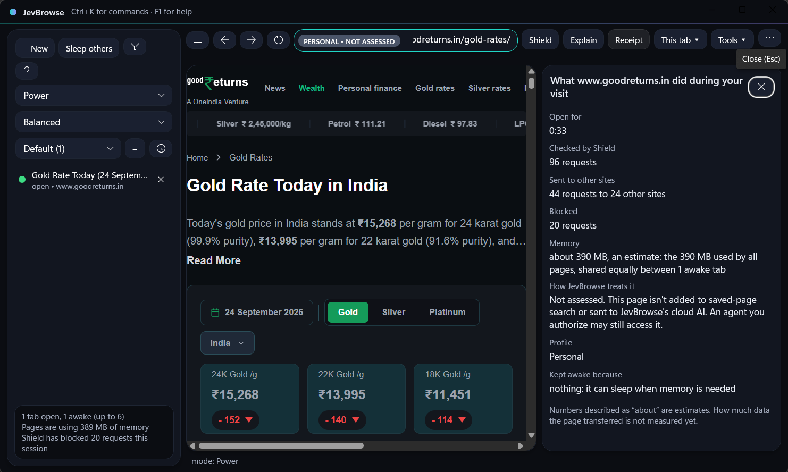
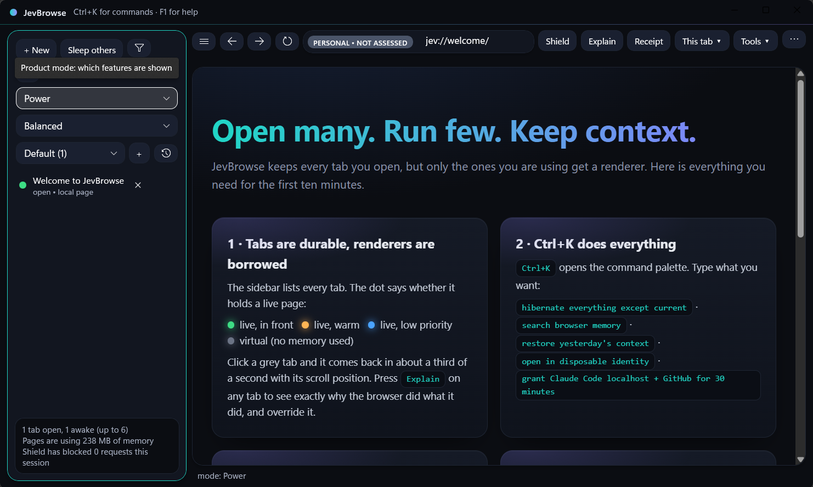
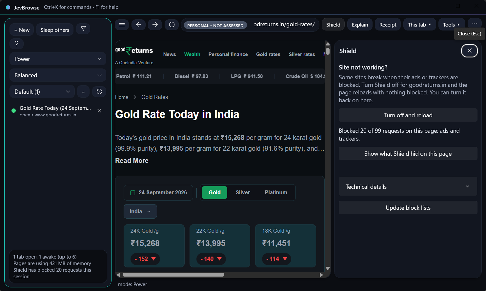
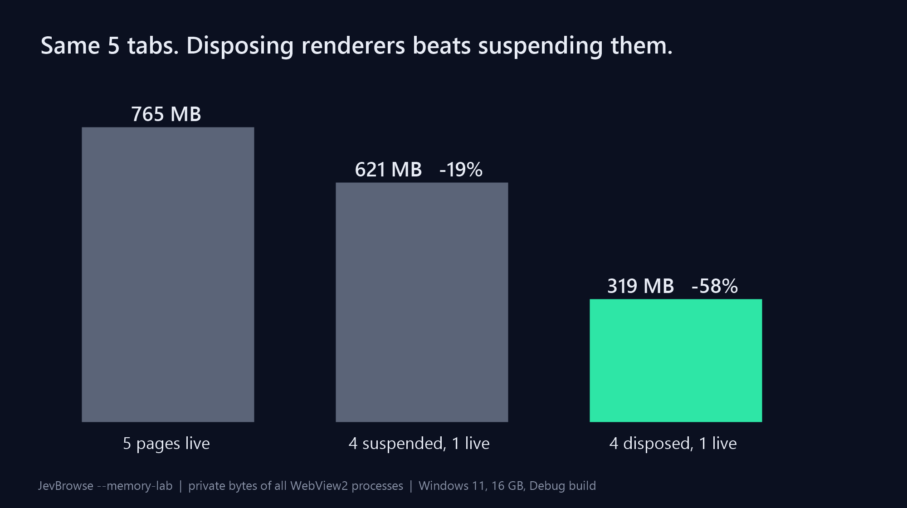

# JevBrowse

**Open many. Run few. Keep context. Explain everything.**

A Windows browser that keeps hundreds of tabs open without hundreds of pages running, keeps each part of your life in its own workspace, and can tell you *why* it did anything. Open source (MPL-2.0), built on WebView2 (the same engine as Edge), no account, no telemetry.

> **Status: public alpha (0.1.x).** Open source under MPL-2.0 and usable every day, but expect rough edges. Builds are **unsigned** (Windows SmartScreen will warn), have only been exercised on one development machine so far, and the security fix that stops a web page forging a browser shortcut has not yet had an independent review. [What is and is not proven](docs/EVIDENCE_MATRIX.md) lists every claim with its test or measurement; the [release notes](docs/releases/) say what each build has and has not been through. Please [report bugs](../../issues), especially compatibility problems on your own sites.

## See it

| | |
|---|---|
| <br>**Receipt**: what a site did during your visit: requests checked, sent to other sites, blocked, memory, and how JevBrowse treated the page. | <br>**Open many. Run few.** Every tab is a saved record; only the ones you use hold a live renderer. |
| <br>**Shield** shows its work and turns off per site in one click. | <br>**Measured, not claimed** (`--memory-lab`, Debug build, one machine): disposing 4 of 5 renderers cut private memory 58%; suspending only 19%. |

## What is different

| You get | How |
|---|---|
| **Low memory with many tabs.** Tabs you are not using sleep and wake where you left off (scroll position, Back and Forward included). Tabs with unfinished work (typing, an upload, a call, a download, a playing video) are never put to sleep. | Virtual-tab kernel: a tab is a saved record, a renderer is a lease. |
| **Workspaces that do not leak into each other.** Personal, Work and your own, each with separate sign-ins and cookies. Rename, delete, and **Time Travel** back to how a workspace looked earlier. | Workspaces are scheduling and identity domains. |
| **Private sessions that leave nothing.** No history, no bookmarks, no saved tabs, no zoom memory. Ending one deletes its data, and a crash mid-session does not bring it back. | Identity containers plus a crash-tested storage layer. |
| **A privacy model you can read.** Every page is classed Public, Unknown, Signed-in, Sensitive or Secret. The class decides what may be saved, searched or ever shown to an AI. Banking and health pages are kept out of history and search by default. | Trust OS. |
| **Ad and tracker blocking that explains itself.** 110k rules, per-site off switch and a "fix this site" button. | Deterministic Shield, not a black box. |
| **Search what you have read, on your device.** | Browser Memory (local full-text index; never Private or Sensitive pages). |
| **Agents on a leash.** Optional AI agents get scoped, time-limited permission, work in disposable workspaces, and every action is audited. | Agent Gateway. |
| **Nothing to take on faith.** Every claim links to a test or a measurement. | [Evidence matrix](docs/EVIDENCE_MATRIX.md). |

### Everyday features
Bookmarks (Ctrl+D, import from Chrome/Edge/Firefox export) · history (Ctrl+H) · downloads list with Show in folder (Ctrl+J) · search-engine choice · per-site zoom (Ctrl+ / Ctrl- / Ctrl+0) · resume where you left off · site permissions and Clear website data per profile · links from other apps and default-browser registration · light and dark themes · command palette (Ctrl+K).

### Known limits (alpha)
- Windows 11 x64 only. Unsigned, so Windows SmartScreen will warn; see the release notes for the SHA-256 to check.
- Sign-in pop-ups that hand a token back to the opening page (some "Sign in with…" buttons) do not work yet; use the site's redirect sign-in where offered.
- Back/Forward across sleep replays addresses: form state, POST results and per-page scroll are not restored.
- Zoom is applied as page zoom, which differs from the engine's zoom on pages that size things in viewport units.
- No sync, no extensions, no automatic updates yet.

## Get it
Download the latest zip from the [releases page](../../releases), extract anywhere, run `JevBrowse.App.exe`. It needs the [WebView2 Runtime](https://developer.microsoft.com/microsoft-edge/webview2/) (already on Windows 11 with Edge); if it is missing JevBrowse tells you and offers the download. Your data lives in `data\` beside the program; delete the folder to remove everything. To use it for links from other programs: More menu, *Make JevBrowse your default browser*.

## Build and hack on it
Requirements: Windows 11, the .NET 10 SDK, Git. No Visual Studio.

```powershell
git clone https://github.com/reddy5310/jevbrowse ; cd jevbrowse
. .\scripts\env.ps1          # optional: keeps SDK, caches and data on the drive you choose
.\scripts\dev.ps1 test       # all unit tests (~600, about a minute)
.\scripts\dev.ps1 run        # build and start the app
.\scripts\dev.ps1 check      # tests + build + the real-engine checks (a few minutes)
```

Where things are:

| Folder | What |
|---|---|
| `src/JevBrowse.Domain` | Pure models and rules (address input, bookmarks import, data classes). Start here: no dependencies, easy to test. |
| `src/JevBrowse.VirtualTabs` | The kernel: tab lifecycle, checkpoints, workspaces, Time Travel. |
| `src/JevBrowse.Storage` | SQLite (versioned, hash-pinned migrations). |
| `src/JevBrowse.TrustOS`, `Shield`, `Memory`, `Brain`, `AgentGateway`, `DevSpace`, `ResourceOS` | The subsystems ([architecture](docs/BUILD_PLAN.md), [ADRs](docs/adr/)). |
| `src/JevBrowse.App` | The WinUI 3 shell and WebView2 adapters. Also the real-engine `--*-check` modes. |
| `tests/Unit/*` | xUnit. Kernel behaviour runs against `FakeLeaseManager`, never a real browser. |
| `scripts/*` | Release, packaged smoke, crash-recovery and UI checks. |

Good first contributions are labelled `good first issue`; [CONTRIBUTING.md](CONTRIBUTING.md) explains how a change is checked (including the "mutation check" we ask for on fixes) and the rules a change must not break. Security problems: [SECURITY.md](SECURITY.md), please do not open a public issue.

Optional AI: set `OPENROUTER_API_KEY` (and `OPENROUTER_MODEL`) or `JEV_API_KEY` in your environment, then turn AI on in the Brain panel. **Ask** and **Explain error** send only when you click, after showing what will be sent and what was redacted. Pages that are private, secret or sensitive are never sent. Every first-party network call is listed in [`docs/privacy/NETWORK_CALLS.md`](docs/privacy/NETWORK_CALLS.md).

## Documents
[Product constitution](docs/PRODUCT_CONSTITUTION.md) · [Evidence matrix](docs/EVIDENCE_MATRIX.md) · [Roadmap](docs/ROADMAP.md) · [Backlog](docs/BACKLOG.md) · [Release checklist](docs/RELEASE_CHECKLIST.md) · [Release runbook](docs/RELEASE_RUNBOOK.md) · [Clean-Windows checklist](docs/CLEAN_WINDOWS_CHECKLIST.md) · [Governance](GOVERNANCE.md) · [Security](SECURITY.md)

## License
Code: [Mozilla Public License 2.0](LICENSE). Modify and redistribute freely; changes to MPL-covered files must be published under the same license; embedding in larger works, including proprietary ones, is permitted. Name and logo: [TRADEMARK.md](TRADEMARK.md); modified builds must be renamed.
